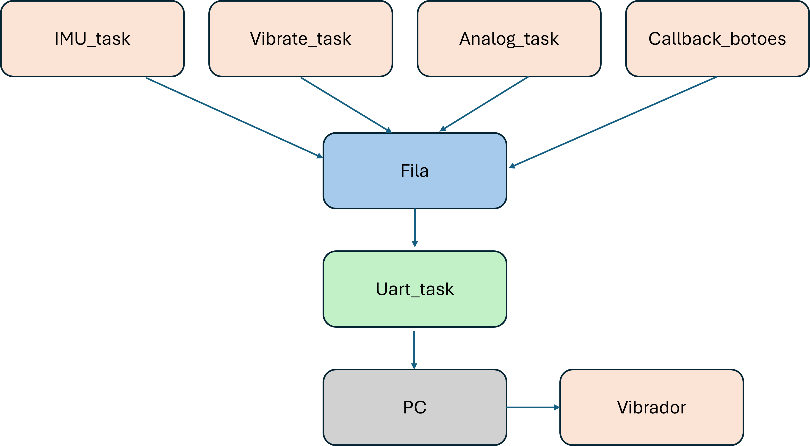
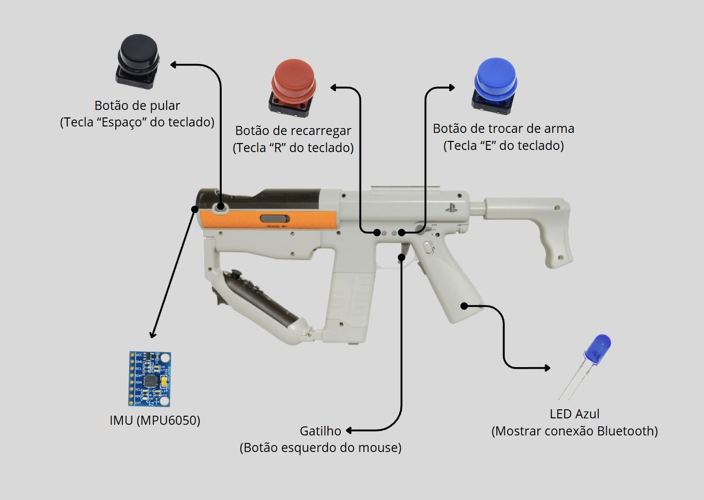
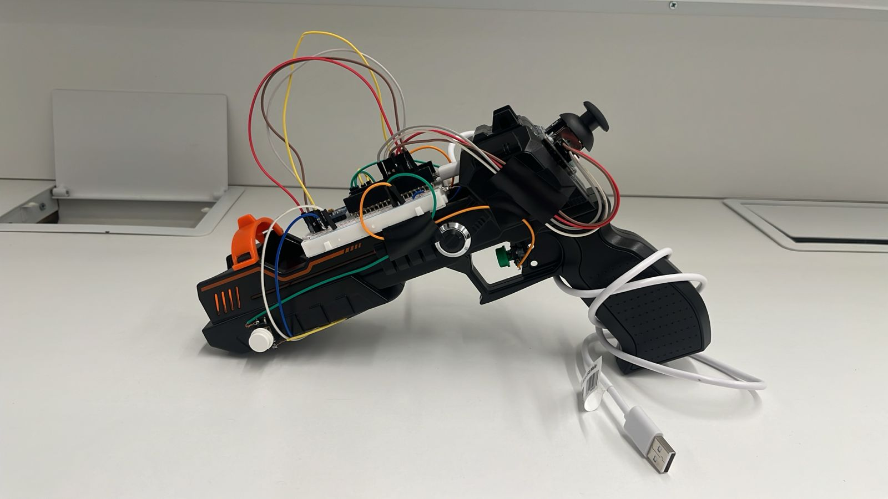

# Controle Customizado para Shell Shockers usando uma pisctola fisica

Link para video de apresentação: https://youtu.be/sFyntL15UdM

## Jogo
**Shell Shockers** – Um jogo de tiro multiplayer em primeira pessoa, jogado diretamente no navegador, em que ovos armados participam de partidas um contra o outro, o objetivo é atirar para matar os outros participantes. 

## Ideia do Controle
Desenvolvemos um controle físico no formato de pistola, trazendo maior imersão ao jogo ao permitir que o jogador aponte fisicamente a arma para mirar.
A mira é controlada por uma IMU (MPU6050), substituindo o movimento do mouse, e a movimentação é feita por um joystick analógico. Botões físicos disparam as ações típicas do jogo (tiro, pulo, recarregar, trocar de arma), e um motor de vibração fornece feedback tátil.

## Inputs e Outputs

### **Entradas (Inputs)**

- **IMU (MPU6050):**
  - Controle da mira com base na inclinação da pistola (eixos X e Y)

- **Joystick analógico (2 canais ADC):**
  - Controle de movimentação (W, A, S, D)

- **4x Entradas Digitais:**
  - **Gatilho:** Tiro (mapeado para clique esquerdo do mouse)
  - **Botão de recarregar:** Tecla “R”
  - **Botão de lança granada:** Tecla "Q"
  - **Botão de troca de arma:** Tecla “E”

### **Saídas (Outputs)**
- **Motor de vibração (Vibracal):** Ativado ao atirar

## Protocolo Utilizado

- **UART** para comunicação serial com o computador.Formato de mensagem:
[0xFF][AXIS][VAL0][VAL1]
Exemplo: Eixo 6 (movimento para direita), valor 1

Eixos:
| Axis | Função               |
| ---- | -------------------- |
| 0    | Movimento Mouse X    |
| 1    | Movimento Mouse Y    |
| 2    | Clique (tiro)        |
| 3    | Recarregar (`R`)     |
| 4    | Pulo (`Espaço`)      |
| 5    | Trocar arma (`E`)    |
| 6    | Mover Direita (`D`)  |
| 7    | Mover Esquerda (`A`) |
| 8    | Mover Baixo (`S`)    |
| 9    | Mover Cima (`W`)     |

## Diagrama de Blocos Explicativo do Firmware

### **Estrutura Geral**

#### **Principais Componentes do RTOS**
- **Tasks:**
  - imu_task: Leitura e envio da orientação da IMU
  - analog_task: Leitura dos eixos do joystick
  - button_task: Callback por interrupção para botões digitais
  - uart_task: Envio serial dos eventos para o PC

- **Filas:**
  - xQueuePos: Enfileira eventos do tipo mouse_event_t

 **Interrupções:**
  - GPIOs dos botões

- **Controle de vibração:**
  - Ativado dentro do button_task ao detectar disparo

## Imagens do Controle

### **Proposta Inicial**

## **Protótipo Real**

## Estrutura dos Arquivos:

| Arquivo                 | Descrição                                                               |
| ----------------------- | ----------------------------------------------------------------------- |
| `main.c`                | Inicializa hardware e tasks principais                                  |
| `imu_task.c/h`          | Leitura do MPU6050 + fusão de sensores                                  |
| `analog_task.c/h`       | Leitura dos eixos X/Y do joystick (ADC)                                 |
| `button_task.c/h`       | Setup de GPIOs + interrupções + controle do vibrador                    |
| `uart_task.c/h`         | Montagem e envio dos pacotes UART para o PC                             |
| `queues.c/h`            | Criação e acesso às filas globais                                       |
| `python/control_gui.py` | GUI e interpretação dos dados no computador (com `pyautogui`, `pynput`) |
